# Modélisation de la Base de Données - HospiPlan

Ce document présente l'approche de modélisation retenue pour la Phase 1 du projet HospiPlan. Il contient le diagramme d'entité-association (ERD) ainsi que la description détaillée de la logique de conception pour respecter les contraintes métier de l'Hôpital Al Amal.

> [!NOTE]
> La modélisation utilise PostgreSQL comme SGBD cible. Le schéma a été pensé pour atteindre la forme normale 3NF avec l'application du patron de conception `Temporal Property` pour la gestion des historiques.

## Diagramme Entité-Relation (ERD)

```mermaid
erDiagram
    %% Personnels et Profils
    SOIGNANT {
        int id PK
        string matricule UK
        string nom
        string prenom
        string email
        string telephone
        boolean is_actif
    }
    GRADE {
        int id PK
        string libelle "ex: Infirmier, Médecin"
        boolean eligibilite_garde_nuit
    }
    SPECIALITE {
        int id PK
        string libelle
        int parent_id FK "Hiérarchie de spécialité"
    }
    SOIGNANT_SPECIALITE {
        int soignant_id PK, FK
        int specialite_id PK, FK
    }

    SOIGNANT }|--|| GRADE : "possède un grade"
    SOIGNANT ||--o{ SOIGNANT_SPECIALITE : "a pour"
    SPECIALITE ||--|{ SOIGNANT_SPECIALITE : "est détenue par"
    SPECIALITE |o--o{ SPECIALITE : "sous-spécialité de"

    %% Contrats (Temporal Property)
    CONTRAT {
        int id PK
        int soignant_id FK
        string type_contrat "CDI, CDD, Intérim..."
        date date_debut
        date date_fin "NULL si contrat en cours indéterminé"
        float pourcentage_tps_travail "ex: 1.0 pour 100%"
        float heures_max_hebdo
    }
    SOIGNANT ||--o{ CONTRAT : "historique des contrats"

    %% Certifications et Prérequis
    CERTIFICATION {
        int id PK
        string libelle
        int prerequis_id FK "Certification parent (optionnel)"
    }
    SOIGNANT_CERTIFICATION {
        int id PK
        int soignant_id FK
        int certification_id FK
        date date_obtention
        date date_expiration "Peut être passée (historique)"
    }
    CERTIFICATION |o--o{ CERTIFICATION : "a pour prérequis"
    CERTIFICATION ||--o{ SOIGNANT_CERTIFICATION : "est obtenue"
    SOIGNANT ||--o{ SOIGNANT_CERTIFICATION : "détient / a détenu"

    %% Services et Unités (Historisation de l'état)
    SERVICE {
        int id PK
        string nom
        int soignant_responsable_id FK
        int capacite_lits
        int niveau_criticite
    }
    ETAT_SERVICE {
        int id PK
        int service_id FK
        string statut "OUVERT, FERME, SOUS_EFFECTIF"
        date date_debut
        date date_fin
    }
    UNITE_SOIN {
        int id PK
        int service_id FK
        string nom
    }
    SERVICE ||--o{ ETAT_SERVICE : "historique des fermetures"
    SERVICE ||--o{ UNITE_SOIN : "est composé de"
    SOIGNANT ||--o| SERVICE : "gère le service (responsable)"

    %% Affectation des Soignants aux Services (Historique)
    SOIGNANT_SERVICE {
        int id PK
        int soignant_id FK
        int service_id FK
        date date_debut
        date date_fin "NULL si encore affecté"
    }
    SOIGNANT ||--o{ SOIGNANT_SERVICE : "appartient à (histo)"
    SERVICE ||--o{ SOIGNANT_SERVICE : "comprend"

    %% Charge Patiente (Journalière)
    CHARGE_PATIENTE {
        int id PK
        int unite_id FK
        date date_releve
        int nombre_patients
    }
    UNITE_SOIN ||--o{ CHARGE_PATIENTE : "mesure d'occupation"

    %% Gardes et Postes
    TYPE_GARDE {
        int id PK
        string libelle "Jour, Nuit, Astreinte..."
        boolean is_nuit
        boolean is_astreinte
        int duree_standard_heures
    }
    POSTE_GARDE {
        int id PK
        int unite_id FK
        int type_garde_id FK
        datetime debut_prevu
        datetime fin_prevue
        int nb_soignants_min
        int nb_soignants_max
    }
    POSTE_CERTIFICATION_REQUISE {
        int poste_id PK, FK
        int certification_id PK, FK
    }
    UNITE_SOIN ||--o{ POSTE_GARDE : "offre"
    TYPE_GARDE ||--o{ POSTE_GARDE : "catégorise"
    POSTE_GARDE ||--o{ POSTE_CERTIFICATION_REQUISE : "exige"
    CERTIFICATION ||--o{ POSTE_CERTIFICATION_REQUISE : "est requise par"

    %% Affectations (Réalisation des gardes par les soignants)
    AFFECTATION {
        int id PK
        int poste_id FK
        int soignant_id FK
        string statut "VALIDE, ANNULE"
    }
    POSTE_GARDE ||--o{ AFFECTATION : "est couvert par"
    SOIGNANT ||--o{ AFFECTATION : "couvre"

    %% Absences
    TYPE_ABSENCE {
        int id PK
        string libelle "Congé payé, Maladie..."
        boolean impacte_quota_garde
    }
    ABSENCE {
        int id PK
        int soignant_id FK
        int type_absence_id FK
        date date_debut
        date date_fin_prevue
        date date_fin_reelle
    }
    SOIGNANT ||--o{ ABSENCE : "est absent"
    TYPE_ABSENCE ||--o{ ABSENCE : "catégorise"

    %% Préférences et Contraintes Soignant
    CONTRAINTE_SOIGNANT {
        int id PK
        int soignant_id FK
        string description
        boolean est_imperative "VRAI=Contrainte, FAUX=Préférence"
        datetime datetime_debut
        datetime datetime_fin
        date valide_jusqu_au "Historisation de la règle"
    }
    SOIGNANT ||--o{ CONTRAINTE_SOIGNANT : "déclare"

    %% Prêts inter-services
    PRET_SERVICE {
        int id PK
        int soignant_id FK
        int service_origine_id FK
        int service_destination_id FK
        datetime date_debut
        datetime date_fin
    }
    SOIGNANT ||--o{ PRET_SERVICE : "est prêté"
    SERVICE ||--o{ PRET_SERVICE : "prête / emprunte"

    %% Règles légales globales (Configurables)
    REGLE_LEGALE {
        string code PK "ex: MAX_NUIT_CONSECUTIVES, REPOS_POST_NUIT"
        string description
        float valeur_numerique
        string unite "heures, nb_jours..."
    }
```

## Dictionnaire de Données et Justification des Choix

> [!TIP]
> **Pourquoi ces choix architecturaux ?**

### 1. Modélisation Temporelle (Historisation)
Pour répondre aux exigences F-02 (Contrats), F-03 (Certifications) et le suivi des affectations aux services :
- Nous utilisons le patron de conception **Temporal Property**. Un contrat n'écrase pas le précédent. Au lieu de cela, chaque contrat est une ligne avec `date_debut` et `date_fin`. Un `date_fin` à `NULL` signifie que c'est l'état actuel et actif.
- Idem pour `SOIGNANT_CERTIFICATION` et `SOIGNANT_SERVICE` : Le soignant accumule des enregistrements au cours du temps.

### 2. Récursivité (Structures arborescentes)
- L'exigence F-01 stipule qu'une spécialité peut être une sous-spécialité (ex: Cardiologie infantile sous Cardiologie). La table `SPECIALITE` a un attribut `parent_id` (clé étrangère vers `SPECIALITE.id`).
- Idem pour `CERTIFICATION` et `prerequis_id` qui référence une autre certification (F-03).

### 3. Modélisation de la Charge Patiente (Temporalité Fine)
- Selon l'exigence F-08, la charge doit être saisie par unité et *par jour*. Pour éviter une table unique énorme et peu performante, on utilise `CHARGE_PATIENTE` avec `date_releve`. On recommande, niveau implémentation, de partitionner cette table (Table Partitioning sous PostgreSQL) par mois ou année si le volume devient trop important.

### 4. Conception des Règles Configurables
- La table `REGLE_LEGALE` résout F-10. Plutôt que de coder les règles en dur dans l'application, on définit des clés métiers (ex: `TEMPS_REPOS_MIN_APRES_NUIT`) et leurs valeurs dans cette table (ex: 11 heures). L'application backend lira ces configurations.

### 5. Normalisation 3NF
Le schéma ne contient aucune dépendance transitive :
- Les infos d'un soignant (nom, prénom) dépendent uniquement du soignant.
- Le type de garde a ses propres règles (durée, is_nuit), le poste (un exemplaire du type de garde instancié à un jour J) hérite de ses caractéristiques via la relation mais sans duplication sémantique.
- L'intégrité référentielle garantit l'impossibilité d'affecter un soignant à un service fantôme.

---

La création des scripts SQL qui traduisent ces entités (avec contraintes CHECK et triggers si nécessaire) se trouve dans `db/schema.sql`.
