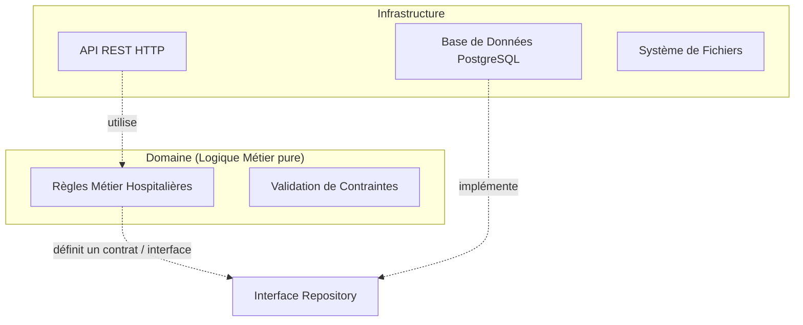

# Architecture Scalable et Modulaire pour la Production

Ce document fait partie de ton apprentissage pour t'aider à passer d'un projet "scolaire" à un projet prêt pour le monde professionnel. Tu as évoqué le besoin de **modularité extrême** (changer de Base de Données, changer de langage sur une partie, distribuer la DB, travailler à plusieurs). Voici comment les pros résolvent ces problématiques.

## 1. Le Piège du Monolithe Fortement Couplé

Actuellement, ton projet utilise **Django**. Django est un framework fantastique, mais il pousse naturellement vers le pattern **Active Record** (le Modèle contient à la fois les données et les requêtes SQL, et est utilisé directement dans les Vues).

**Le problème :**
Si demain tu souhaites changer de Base de Données (ex: passer de SQL à NoSQL pour une partie des données), ou si tu veux réécrire une fonctionnalité métier complexe en Go ou Rust pour des raisons de performance, c'est **impossible sans tout casser**. Tout est entremêlé.

## 2. La Solution : L'Architecture Hexagonale (Clean Architecture)

Pour être résilient au changement, il faut inverser les dépendances. Le cœur de ton application (la logique métier) ne doit RIEN savoir du monde extérieur (ni de l'API web, ni de la base de données).

- **Le Domaine** : Contient uniquement du Python pur (classes, fonctions). Aucune importation `django.db` ou `django.http`. C'est là que vivent les règles métier de l'hôpital.
- **Les Ports (Interfaces)** : Le domaine définit ce dont il a besoin (ex: `class PersonnelRepository: def get_by_id(self, id): pass`).
- **Les Adapteurs (Infrastructure)** : Django, ton framework REST, et ton ORM vont implémenter ces interfaces.

> [!TIP]
> **Pourquoi c'est magique ?** Si tu veux changer de DB, tu ne touches pas au Domaine. Tu écris juste un nouvel Adapteur (ex: `MongoDbPersonnelRepository`) et tu l'injectes. Ou si Django ne te plait plus, tu passes sur FastAPI sans retoucher une seule ligne de tes règles de validation hospitalières.

## 3. Microservices vs Monolithe Modulaire

Tu as parlé de "changer le langage d'une partie de l'application" ou de "travailler avec d'autres devs".

### Monolithe Modulaire (L'Étape 1 indispensable)
Garde un seul dépôt de code (Monorepo), mais divise ton code en "Bounded Contexts" (Contextes Délimités) stricts.
- `module_personnel`
- `module_plannings`
- `module_contraintes`
Ils ne peuvent communiquer entre eux que par l'appel de fonctions bien définies (comme s'ils étaient des APIs séparées). S'ils respectent cela, une équipe peut travailler sur `personnel` sans bloquer l'équipe `plannings`.

### Microservices (L'Étape 2)
Quand le Monolithe Modulaire fonctionne bien et que l'équipe grandit (ou qu'un besoin de scaling spécifique apparait), tu peux l'éclater.
- Le backend `Plannings` pourrait être extrait et codé en **Go** (car c'est de l'algorithmique de graphes très gourmande).
- Le backend `Personnel` pourrait rester en **Python/Django**.
Ils communiquent via **API REST** interne, **gRPC**, ou des files de messages (**RabbitMQ** ou **Kafka**).

> [!WARNING]
> Ne commence **JAMAIS** directement par des Microservices. C'est l'erreur numéro 1. La complexité de l'infrastructure, du réseau, et de la distribution des données tuera ton projet avant même qu'il ne sorte. Commence toujours en Monolithe Modulaire.

## 4. Agnosticité de l'Environnement (Docker)

Tu as évoqué la gestion de l'environnement. Actuellement tu utilises sûrement un environnement virtuel `.venv`. Sur le PC d'un autre dev, avec Windows ou Mac, les versions de dépendances ou de l'OS pourraient casser l'application ("*Mais ça marche sur ma machine !*").

La solution professionnelle absolue : **Docker**.
- Docker "emballe" ton code, le framework, et le système d'exploitation minimal dans un "Conteneur".
- Avec `docker-compose.yml`, tu peux démarrer d'une seule commande : le backend, le frontend, la base de données PostgreSQL, et un cache Redis. C'est l'autonomie garantie pour chaque dev. Que tu sois sur Linux, Mac ou Windows, le résultat sera 100% identique.

## 5. Déploiement, Git et CI/CD (L'approche pro)

La moindre modification ne doit rien casser.
Pour y arriver, on ne met jamais de code manuellement en production. On automatise tout.
1. Tu utilises **Git** rigoureusement : Jamais de `commit` sur `main`. Tu utilises des branches `feature/nom_de_la_fonctionnalite`.
2. À chaque *Push* sur GitHub, une **Pipeline CI** (Intégration Continue, ex: GitHub Actions) se déclenche sur un serveur distant.
3. La pipeline exécute **Automatiquement** des Tests Unitaires, des Tests d'Intégration, l'analyse de code (Linting) et vérifie la sécurité.
4. Si un seul test échoue, le déploiement ou la fusion (Merge) est bloqué.
5. Si tout est vert, le code est transformé en image Docker et déployé automatiquement (CD - Continuous Deployment) sur tes serveurs.

---

> [!IMPORTANT]
> Pour **HospiPlan**, le plan d'action vise à transformer l'architecture actuelle (couplée) en **Monolithe Modulaire** en introduisant Docker, la configuration de base CI/CD, et l'isolation des règles métier. C'est la base indispensable pour garantir ton autonomie totale en production.
